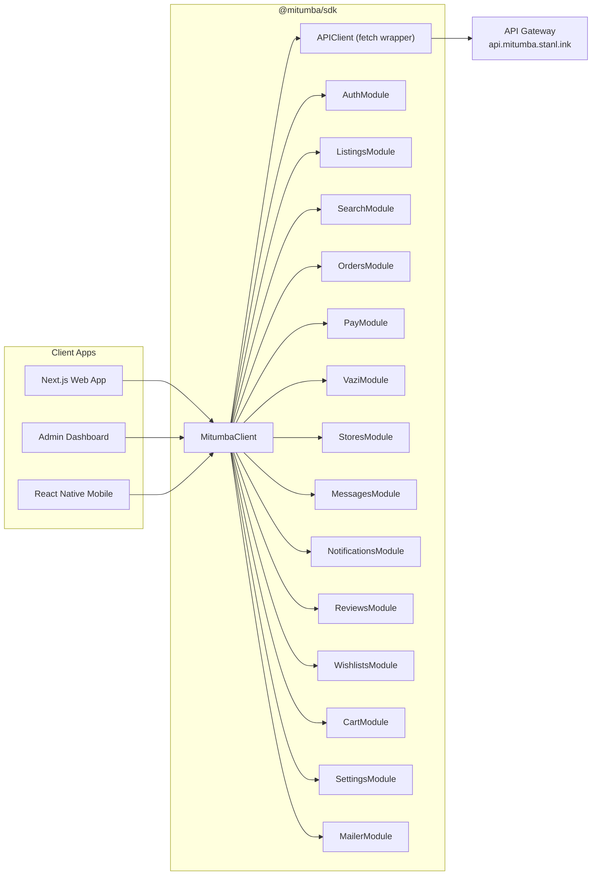
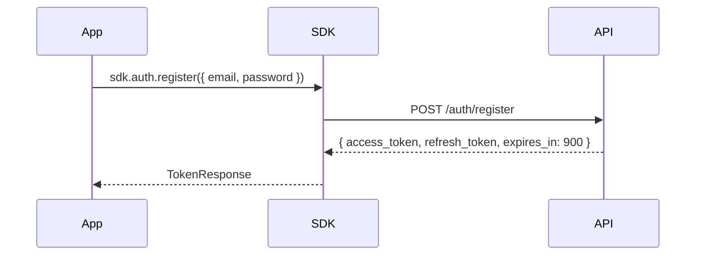
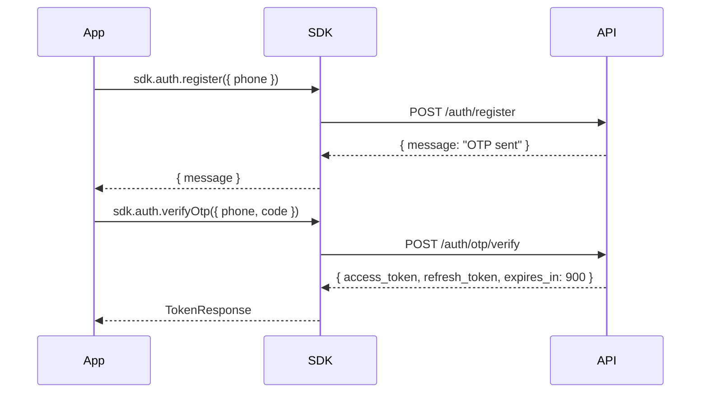
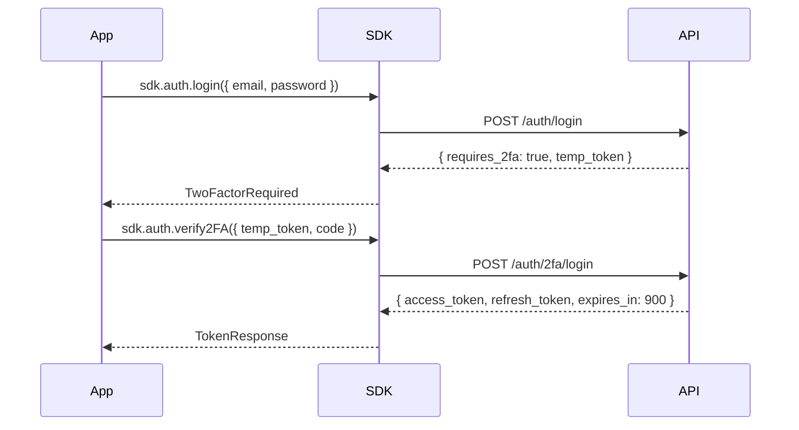

# @mitumba/sdk — Architecture

This document describes the internal architecture of the `@mitumba/sdk` TypeScript library — how the client is structured, how it maps to the Mitumba API, and the conventions every module must follow.

---

## System Overview



All client applications interact with a **single API gateway** at `https://api.mitumba.stanl.ink`. The SDK wraps every public endpoint behind typed, ergonomic methods.

---

## Module-to-Endpoint Mapping

| SDK Module | API Prefix | Auth | Description |
|---|---|---|---|
| `sdk.auth` | `/auth/*` | Mixed | Registration, login (email + phone OTP), 2FA, token lifecycle, email verification, onboarding |
| `sdk.listings` | `/listings/*` | Mixed | Browse feed, CRUD listings, seller storefronts, image upload, similar listings |
| `sdk.search` | `/search/*` | Mixed | Full-text search with filters, trending terms, search history |
| `sdk.orders` | `/orders/*` | Protected | Create orders, track lifecycle, view history, multi-store checkout |
| `sdk.pay` | `/pay/*` | Protected | M-Pesa STK Push, Paystack payments, payment status polling |
| `sdk.vazi` | `/vazi/*` | Public | AI-powered outfit feed and outfit completion |
| `sdk.stores` | `/listings/stores/*` | Mixed | Store CRUD, follow/unfollow, stats, settings, analytics |
| `sdk.messages` | `/notify/messages/*` | Protected | Conversations (store-scoped), message threads, send messages |
| `sdk.notifications` | `/notify/notifications/*` | Protected | Notification feed with unread count, mark as read |
| `sdk.reviews` | `/listings/stores/:id/reviews` | Mixed | List store reviews, create review |
| `sdk.wishlists` | `/listings/wishlists/*` | Protected | Save/unsave listings |
| `sdk.cart` | `/listings/cart/*` | Protected | Cart management, multi-store checkout |
| `sdk.settings` | `/auth/*` | Protected | Profile, security (sessions, 2FA, password), addresses, payment methods, linked accounts, notification prefs |
| `sdk.mailer` | `/notify/email` | Protected | Send typed transactional emails (39 templates) |

> **Note:** The Seller Trust Index (STI) is an internal scoring system. It surfaces through seller profile data in listings and search results but has no direct SDK module. STI data is read-only from the SDK's perspective.

---

## Core Client Architecture

The SDK is built in four layers:

### 1. `MitumbaClient` — Entry Point

The public-facing class that consumers instantiate. It:
- Accepts configuration (`baseUrl`, `token`, `refreshToken`, `onTokenRefresh`, `debug`, `maxRetries`)
- Creates and holds a single `APIClient` instance
- Initializes all 14 domain modules as readonly properties

```typescript
const sdk = new MitumbaClient({
  baseUrl: 'https://api.mitumba.stanl.ink',
  debug: true,       // Logs all HTTP requests and latency
  maxRetries: 3,     // Retries 5xx errors with exponential backoff
})

sdk.listings.getFeed({ city_id: 'nairobi' })
```

### 2. `APIClient` — Fetch Wrapper (`client.ts`)

The internal HTTP layer. It handles:
- **Base URL resolution** — prepends the configured `baseUrl` to all paths
- **Authorization** — injects `Authorization: Bearer <token>` on every request
- **Query params** — serializes objects into URL search params for GET requests
- **JSON parsing** — extracts and returns the response body
- **Error wrapping** — converts non-2xx responses into typed `APIError` instances
- **Token refresh** — intercepts 401 responses, calls refresh, retries the request (with deduplication)
- **Retry logic** — retries on 5xx errors and network failures with exponential backoff
- **Request cancellation** — supports `AbortController` via `RequestOptions.signal`
- **Debug logging** — logs requests, responses, and timings when `debug: true`

```typescript
// Generic methods (all accept optional RequestOptions):
client.get<T>(path, params?, options?)    → Promise<T>
client.post<T>(path, body?, options?)     → Promise<T>
client.put<T>(path, body?, options?)      → Promise<T>
client.patch<T>(path, body?, options?)    → Promise<T>
client.delete<T>(path, options?)          → Promise<T>
```

### 3. `APIError` — Typed Error Class

Every non-2xx API response becomes an `APIError`:

```typescript
class APIError extends Error {
  code: string        // machine-readable: 'invalid_credentials', 'not_found'
  message: string     // human-readable description
  status: number      // HTTP status code
  details?: unknown   // optional Zod validation details (400 errors)
}
```

### 4. Domain Modules

Each module is a class that receives the `APIClient` via constructor injection:

```typescript
class ListingsModule {
  constructor(private readonly client: APIClient) {}
  // ...typed methods
}
```

---

## Authentication Flow

The API supports **dual-mode authentication**, controlled server-side:

### Email + Password Mode



### Phone OTP Mode



### 2FA (TOTP) Flow



### Token Lifecycle

| Token | Format | TTL | Storage |
|---|---|---|---|
| Access token | JWT string | 15 minutes | SDK holds in memory |
| Refresh token | 64-char hex | 7 days (default) / 180 days (remember) | Consumer persists (localStorage, SecureStore, etc.) |

- **Automatic refresh:** The SDK's `APIClient` intercepts `401` responses, calls `POST /auth/refresh` with the stored refresh token, retries the original request, and invokes `onTokenRefresh` so the consumer can persist the new pair.
- **Token rotation:** Every refresh invalidates the old refresh token and issues a new pair.
- **Deduplication:** Multiple concurrent 401s share the same refresh promise to avoid race conditions.

---

## Data Conventions

These conventions are enforced by the API and reflected in all SDK types:

| Convention | Format | Example |
|---|---|---|
| **IDs** | 32-char hex (ULID, no dashes) | `a1b2c3d4e5f6...` |
| **Timestamps** | ISO 8601 strings | `2026-05-28T07:00:00.000Z` |
| **Money** | KES integers (no decimals) | `1500` = KSh 1,500 |
| **Phone numbers** | E.164 Kenya format | `+254712345678` |
| **Pagination** | Envelope object | `{ data, total, page, page_size, has_more }` |
| **Errors** | Structured JSON | `{ error, message?, details? }` |

---

## Error Handling Strategy

The SDK converts every API error into an `APIError`. Consumers should catch and handle by `code`:

```typescript
try {
  await sdk.auth.login({ email, password })
} catch (err) {
  if (err instanceof APIError) {
    switch (err.code) {
      case 'invalid_credentials': // wrong email/password
      case 'account_suspended':   // account frozen
      case 'invalid_input':       // validation failure — check err.details
    }
  }
}
```

### Common Error Codes

| Code | Status | When |
|---|---|---|
| `invalid_input` | 400 | Zod validation failure (check `details`) |
| `invalid_credentials` | 401 | Wrong email/password |
| `invalid_token` | 401 | Expired or revoked refresh token |
| `account_suspended` | 403 | Account frozen by admin |
| `not_a_seller` | 403 | Buyer attempting seller-only action |
| `not_found` | 404 | Resource doesn't exist |
| `email_taken` | 409 | Duplicate email on registration |
| `otp_rate_limited` | 429 | Too many OTP requests |
| `network_error` | 0 | Network failure after max retries |
| `internal_error` | 500 | Server error |

---

## Isomorphic Design

The SDK must work in all target environments without polyfills:

- **Browser** — Next.js client components, any SPA
- **Server** — Next.js server components, API routes, Node.js scripts
- **Edge** — Cloudflare Workers, Vercel Edge Functions

This means:
- Use native `fetch` only (no `axios`, no `node-fetch`)
- No Node.js-specific APIs (`fs`, `path`, `Buffer`, etc.)
- No browser-specific APIs (`window`, `document`, `localStorage`)
- Token persistence is the consumer's responsibility
